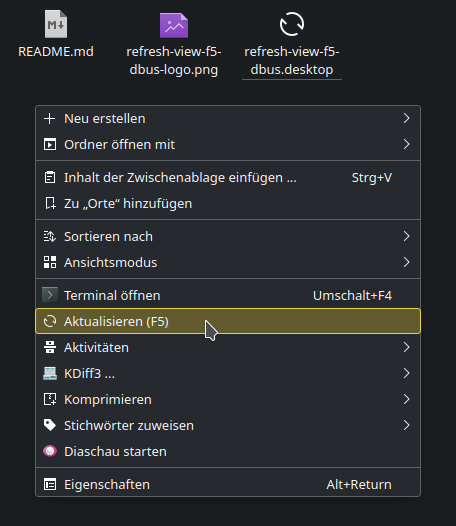

# Refresh View (F5) (D-Bus)

A KDE 5 dolphin context menu extension (aka Service Menu), that let's you
refresh your current view as with F5 (if bound to) via D-Bus from within the
context menu for folders.

Dolphin sometimes failes to refresh it's directory view on the creation or
modification of (new) files. Specifically if there is a huge number of files
inside a directory.

This is for lazy people as me, who want to save the long move with their
pointing device to the "View" menu and "Refresh" from within there and do
not know about F5 keyboard shortcut.

After Installation this new action should be available in top level of the
context meneu. (if more than one action applies to directories, it will be
located under "Actions").

This is a clean room implementation based on D-Bus, therefore it lacks any
dependencies beside qdbus(1), that should come basicly always with KDE.

